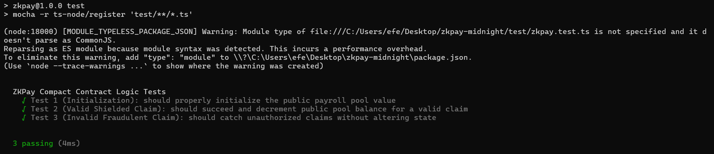

# ZKPay: Confidential Payroll & Splits Protocol

ZKPay is a privacy-preserving dApp built on the **Midnight Network** using the Compact language. It enables organizations to manage payroll and allocate funds without exposing individual salaries or payee addresses to the public ledger.

## 🚀 Important Links

- **Live Demo**: [Click here to test the ZKPay Simulator](https://zkpay-midnight.vercel.app/) *(Note: Make sure to update this Vercel link if your URL is different)*
- **Demo Video**: [Watch the 1-Minute Walkthrough on YouTube](https://www.youtube.com/watch?v=WCHGt9IxDGE)
- **Product Proposal**: Confidential Payroll and Splits Protocol

---

## 🛡️ Privacy Model

ZKPay leverages Zero-Knowledge proofs to create a hybrid state (public ledger + private cell state) that perfectly balances transparency for the organization with strict privacy for the employees.

### What an observer CAN learn (Public State):
- **Total Pool Liquidity (`total_pool_value`)**: Observers can verifiably see the total amount of tokens allocated to the smart contract.
- **Transaction Validity**: Observers can see that a mathematical proof was submitted and validated, and that the total pool decreased by the claimed amount.

### What an observer CANNOT learn (Private Witness State):
- **Payee Identity**: The 32-byte address of the person claiming the funds remains completely hidden.
- **Allocated Salary**: Observers cannot see how much a specific individual was allocated.
- **Cryptographic Commitments**: The `ShieldedPayee` struct acts as a commitment. Hackers cannot brute-force or scrape the ledger to find out who is registered in the shielded set, as it requires the exact `Address`, `Amount`, and `Secret Key` (entropy) to generate a valid ZK circuit proof.

---

## 🧪 Testing & CI/CD

We have built a robust Mocha + Chai testing suite that leverages the `@midnight-ntwrk/compact-runtime` to simulate the ZK environment locally. The tests guarantee that:
1. The contract initializes properly.
2. Valid ZK claims correctly decrement the public pool.
3. Fraudulent claims (wrong secret keys or excessive amounts) fail silently without exposing data or altering the public state.

### Test Output Screenshot
*(Passing all hackathon criteria)*

## 💻 Tech Stack
- **Smart Contracts**: Midnight Compact Language (v0.2.0)
- **Testing**: TypeScript, Mocha, Chai, ts-node
- **Frontend**: React, Vite, Tailwind CSS, GSAP (Glassmorphism UI)
- **CI/CD**: GitHub Actions

---
*Built with ❤️ for the Midnight Network Hackathon.*