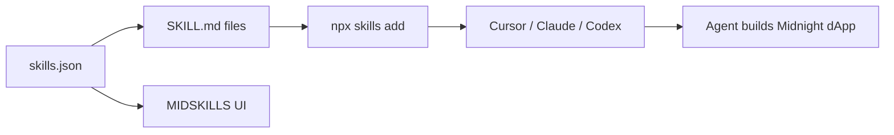

<p align="center">
  
</p>

<p align="center">
  
</p>

<h1 align="center">Midnight Skills</h1>

<p align="center">
  <strong>Knowledge base for AI agents building on Midnight Network</strong>
</p>

<p align="center">
  This project extends the Midnight Network with additional developer tooling.
</p>

<p align="center">
  <a href="https://midnight-skills.netlify.app"></a>
  <a href="LICENSE"></a>
  <a href="https://docs.midnight.network"></a>
</p>

<p align="center">
  Open <code>SKILL.md</code> packages that teach Cursor, Claude Code, Codex, and other agents how to build privacy-preserving dApps — Compact contracts, wallet flows, SDK wiring, and runnable templates.
</p>

<p align="center">
  <a href="#quick-start">Quick Start</a> ·
  <a href="#learning-paths">Learning Paths</a> ·
  <a href="#skills-catalog">Skills Catalog</a> ·
  <a href="#architecture">Architecture</a> ·
  <a href="#contributing">Contributing</a>
</p>

---

## Quick Start

Install the full knowledge base in one command. Agents auto-discover skills from `.agents/skills/` or `.claude/skills/`.

<details open>
<summary><strong>Any agent — Skills CLI (recommended)</strong></summary>

```bash
npx skills add Kali-Decoder/Midnight-skills -y
```

Browse and search skills at [skills.sh](https://skills.sh/).

</details>

<details>
<summary><strong>Cursor</strong></summary>

```bash
npx skills add Kali-Decoder/Midnight-skills -a cursor -y
```

Skills install to `.agents/skills/` in your project (or `~/.cursor/skills/` globally with `-g`).

</details>

<details>
<summary><strong>Claude Code</strong></summary>

```bash
npx skills add Kali-Decoder/Midnight-skills -a claude-code -y
```

Or install the Claude plugin from `.claude-plugin/`.

</details>

<details>
<summary><strong>Codex &amp; other agents</strong></summary>

```bash
npx skills add Kali-Decoder/Midnight-skills -a codex -y
```

The Skills CLI supports 70+ agents. See the [supported agents list](https://github.com/vercel-labs/skills#supported-agents).

</details>

<details>
<summary><strong>Start with the router skill</strong></summary>

Not sure which skill to load? Point your agent at the router first — it maps tasks to the right sub-skill:

```
.agents/skills/midnightskill/SKILL.md
```

</details>

---

## Learning Paths

Curated sequences from `skills.json`. Follow a path end-to-end or jump to any step.

<!-- SKILLS_REGISTRY:LEARNING_PATHS -->
### Build your first Midnight DApp

1. **[Midnight Environment Setup](.agents/skills/midnight-environment-setup/SKILL.md)** — Install Compact, Docker, and proof server
2. **[Why Midnight](.agents/skills/why-midnight/SKILL.md)** — Privacy model and ZK basics
3. **[React Wallet Connector](.agents/skills/react-wallet-connector/SKILL.md)** — Connect a wallet in React
4. **[Compact](.agents/skills/compact/SKILL.md)** — Write your first Compact contract
5. **[Example Hello World](.agents/skills/example-hello-world/SKILL.md)** — Full stack hello-world + tests
6. **[1AM Wallet](.agents/skills/1am-wallet/SKILL.md)** — Deploy and call circuits via 1AM

### DeFi primitives on Midnight

1. **[Token Transfers](.agents/skills/token-transfers/SKILL.md)** — Shielded and unshielded NIGHT flows
2. **[Example Payment Dapp](.agents/skills/example-payment-dapp/SKILL.md)** — Privacy-preserving payment vault
3. **[Example Locker Dapp](.agents/skills/example-locker-dapp/SKILL.md)** — Time-lock vault (vesting, LP locks)
4. **[Example ZK Loan Application](.agents/skills/example-zk-loan-application/SKILL.md)** — ZK credit scoring loan with Schnorr attestation

### Midnight node architecture

1. **[Midnight Consensus](.agents/skills/midnight-consensus/SKILL.md)** — AURA block production and GRANDPA finality
2. **[Midnight Cryptography](.agents/skills/midnight-cryptography/SKILL.md)** — Node-level hashes and signature schemes
3. **[Onchain Logic and State](.agents/skills/midnight-onchain-logic/SKILL.md)** — WASM runtime, FRAME pallets, pallet-midnight
4. **[P2P Networking](.agents/skills/midnight-p2p-networking/SKILL.md)** — libp2p discovery, transport, and gossip
5. **[RPC Interface](.agents/skills/midnight-rpc/SKILL.md)** — JSON-RPC for dApps, wallets, and explorers
6. **[Storage](.agents/skills/midnight-storage/SKILL.md)** — ParityDB, Merkle trie, and state commitments
7. **[Transactions](.agents/skills/midnight-transactions/SKILL.md)** — Proof-based transaction lifecycle
<!-- /SKILLS_REGISTRY:LEARNING_PATHS -->

---

## Skills Catalog

Expand a category to browse skills. Each entry links to a standalone `SKILL.md` your agent can fetch and follow.

<!-- SKILLS_REGISTRY:README_TABLE -->
<details>
<summary><strong>Foundation</strong> — 11 skills · Environment setup, privacy model, Compact language, and testing</summary>

| Skill | Description |
|-------|-------------|
| [Compact](.agents/skills/compact/SKILL.md) | The Compact smart contract language for Midnight Network. TypeScript-like DSL that compiles to ZK circuits. |
| [Midnight Consensus](.agents/skills/midnight-consensus/SKILL.md) | AURA block production, GRANDPA finality, and Cardano Partnerchain validator selection with SPO stake delegation. |
| [Midnight Cryptography](.agents/skills/midnight-cryptography/SKILL.md) | Node cryptographic primitives — Blake2-256, sr25519, ECDSA, Ed25519, and twoxhash storage keys. |
| [Midnight Environment Setup](.agents/skills/midnight-environment-setup/SKILL.md) | Automatically prepare a Midnight dev environment — Compact, PATH, Docker, proof server, and VS Code extension. Run before building or deploying. |
| [Onchain Logic and State](.agents/skills/midnight-onchain-logic/SKILL.md) | WASM runtime, FRAME pallets, pallet-midnight ledger state machine, and proof-based state transitions. |
| [P2P Networking](.agents/skills/midnight-p2p-networking/SKILL.md) | libp2p peer discovery, TCP/WebSocket transport, Noise encryption, Yamux multiplexing, and gossip protocols. |
| [RPC Interface](.agents/skills/midnight-rpc/SKILL.md) | JSON-RPC methods for contract state, ZSwap chain state, ledger version, Polkadot SDK defaults, and Partnerchain RPCs. |
| [Storage](.agents/skills/midnight-storage/SKILL.md) | ParityDB backend, Patricia-Merkle trie state commitments, and twoxhash storage key generation. |
| [Testing](.agents/skills/testing/SKILL.md) | Debug Compact contracts and manage toolchain versions. Static vs dynamic errors, version sync, common traps. |
| [Transactions](.agents/skills/midnight-transactions/SKILL.md) | Proof-based unsigned ledger transactions, pool validation, runtime verification, and state commit lifecycle. |
| [Why Midnight](.agents/skills/why-midnight/SKILL.md) | What Midnight is, why it exists, and how it works — public/private state, selective disclosure, and ZK proofs. |

</details>

<details>
<summary><strong>Wallet & Integration</strong> — 2 skills · 1AM wallet and React connector flows</summary>

| Skill | Description |
|-------|-------------|
| [1AM Wallet](.agents/skills/1am-wallet/SKILL.md) | Integrate 1AM wallet for dust-free contract deployment and transaction flow on Midnight Network. |
| [React Wallet Connector](.agents/skills/react-wallet-connector/SKILL.md) | Scaffold a React + Vite app with DApp Connector API wallet connection, connect/disconnect UI, and unshielded address display. |

</details>

<details>
<summary><strong>SDK & Data</strong> — 3 skills · midnight-js, indexer, and security patterns</summary>

| Skill | Description |
|-------|-------------|
| [Indexer](.agents/skills/indexer/SKILL.md) | Query and subscribe to Midnight blockchain data via Indexer GraphQL API v4. |
| [Midnight.js](.agents/skills/midnight-js/SKILL.md) | TypeScript SDK — provider wiring, wallet SDK, contract deployment, DUST flow, testkit. |
| [Multinetwork](.agents/skills/multinetwork/SKILL.md) | Build a single dApp that deploys across all networks (localnet, preview, preprod, mainnet) from one codebase. |

</details>

<details>
<summary><strong>Domain & Tokens</strong> — 3 skills · NFTs, token transfers, and platform-specific guides</summary>

| Skill | Description |
|-------|-------------|
| [NFT](.agents/skills/nft/SKILL.md) | Build shielded and unshielded NFTs on Midnight using OpenZeppelin Compact contracts. |
| [Security](.agents/skills/security/SKILL.md) | Privacy audit checklist, data leak patterns, defensive Compact patterns. |
| [Token Transfers](.agents/skills/token-transfers/SKILL.md) | Shielded and unshielded token transfers, balance queries, multi-party flows on Midnight. |

</details>

<details>
<summary><strong>Full dApp Templates</strong> — 9 skills · End-to-end reference apps with contracts and frontends</summary>

| Skill | Description |
|-------|-------------|
| [Android Example Voting](.agents/skills/android-example-voting/SKILL.md) | Build a voting/poll dApp on Midnight Network using the Kuira Android SDK — Compact smart contract with create/cast/close circuits, passkey-derived identity, embedded wallet, Compose UI, reactive ledger reads via observeLedger(), and on-device ZK proving. |
| [Example Counter](.agents/skills/example-counter/SKILL.md) | Complete Midnight DApp reference — headless wallet, CLI, counter contract, DUST generation, deploy, interaction. |
| [Example Hello World](.agents/skills/example-hello-world/SKILL.md) | Build a complete Midnight Network hello-world DApp from scratch with Compact, vitest, and FluentWalletBuilder. |
| [Example Leaderboard Dapp](.agents/skills/example-leaderboard-dapp/SKILL.md) | Privacy-preserving arcade leaderboard: submit scores with anonymous/public/custom names and prove ownership via ZK. |
| [Example Locker Dapp](.agents/skills/example-locker-dapp/SKILL.md) | Time-lock vault dApp: lock unshielded NIGHT until a Unix deadline; beneficiary releases via blockTimeGte. |
| [Example Payment Dapp](.agents/skills/example-payment-dapp/SKILL.md) | Privacy-preserving payment vault: deposit/withdraw tNIGHT via Compact + 1AM wallet. |
| [Example Private Party Dapp](.agents/skills/example-private-party-dapp/SKILL.md) | Private party RSVP dApp: persistentCommit guest list, DApp-specific public keys, unshielded NIGHT privacy boundary, Next.js + 1AM wallet. |
| [Example Private Reserve Auction](.agents/skills/example-private-reserve-auction/SKILL.md) | Private reserve auction dApp: hidden reserve price, public bids, private bidder identities, persistentCommit, Map, Counter, receiveUnshielded/sendUnshielded privacy boundary, Next.js + 1AM wallet. |
| [Example ZK Loan Application](.agents/skills/example-zk-loan-application/SKILL.md) | Zero-knowledge loan dApp: privately evaluate credit data with Schnorr attestation, record only loan outcomes on-chain. |

</details>
<!-- /SKILLS_REGISTRY:README_TABLE -->

<p align="center">
  <a href="https://midnight-skills.netlify.app"><strong>Explore all skills on MIDSKILLS →</strong></a>
</p>

---

## How It Works



| Layer | What it does |
|-------|----------------|
| **Registry** | `skills.json` — skills, learning paths, categories, site metadata |
| **Content** | `.agents/skills/*/SKILL.md` — agent instructions, code, troubleshooting |
| **Templates** | `templates/` — runnable dApp scaffolds linked from skills |
| **References** | `references/` — shared provider wiring, gotchas, version pins |
| **Distribution** | `npx skills add`, npm package, GitHub Release tarball |

---

## Architecture

<!-- SKILLS_REGISTRY:ARCHITECTURE -->
- **Registry:** `skills.json` — single source of truth for skills, learning paths, and site metadata
- **Content:** Skill folders, `references/`, and `templates/` in this repository
- **CI:** GitHub Actions validate on PR; publish a versioned registry bundle on release tags
- **UI:** [MIDSKILLS](https://midnight-skills.netlify.app) Next.js app (separate repo) consumes the published registry at build time
- **Agents:** Install skill folders via npm package or fetch from GitHub
<!-- /SKILLS_REGISTRY:ARCHITECTURE -->

<details>
<summary><strong>Repository layout</strong></summary>

```
skills.json              # Registry manifest
.agents/skills/          # Skill content (SKILL.md per skill)
references/              # Shared docs (provider wiring, gotchas)
templates/               # Runnable dApp templates
scripts/                 # validate, sync, package registry
.claude-plugin/          # Claude Code marketplace plugin
```

</details>

---

## Development

**Prerequisites:** Node.js >= 22

```bash
npm run validate:registry   # Check skills.json + on-disk paths
npm run sync:registry     # Update router docs, README, package.json
npm run package:registry  # Build dist/registry/ + tarball (for UI consumers)
```

<details>
<summary><strong>Publish a registry release</strong></summary>

<!-- SKILLS_REGISTRY:REGISTRY -->
1. Edit `skills.json` and skill folders
2. Run `npm run validate:registry`
3. Run `npm run sync:registry` to update router docs and `package.json`
4. Open a PR — CI validates the registry
5. Tag `v*` on `main` to publish `midnight-skills-registry-<version>.tar.gz` as a GitHub Release asset
<!-- /SKILLS_REGISTRY:REGISTRY -->

</details>

---

## Contributing

See **[CONTRIBUTING.md](CONTRIBUTING.md)** for contribution rules and a step-by-step guide to adding a new skill.

```
your-skill/SKILL.md  →  skills.json  →  npm run sync:registry  →  PR
```

**Shared dApp references** live in `references/` — provider wiring and gotchas used by payment, locker, and wallet skills.

**Runnable templates** live in `templates/` — linked from skills via `templatePath` in `skills.json`.

---

## License

Released under the [MIT License](LICENSE).

Copyright (c) 2026  Kali-Decoder , Tushar Pamnani.
